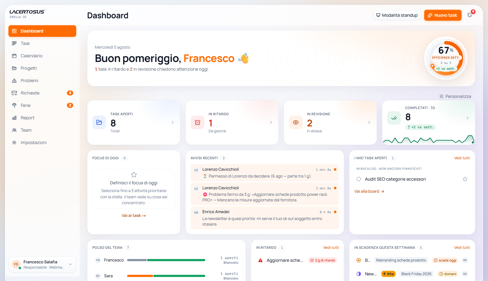
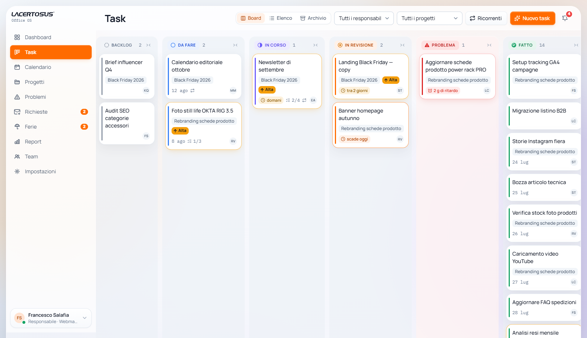
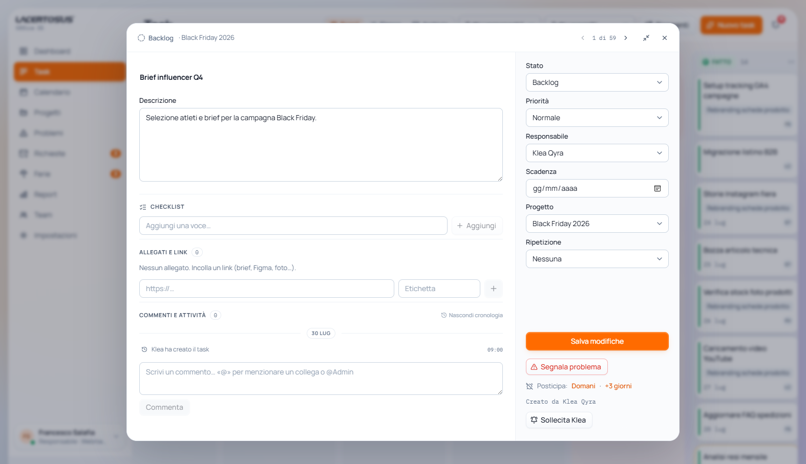
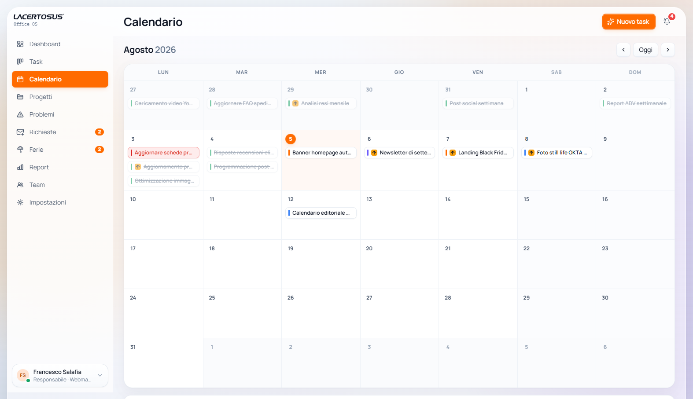
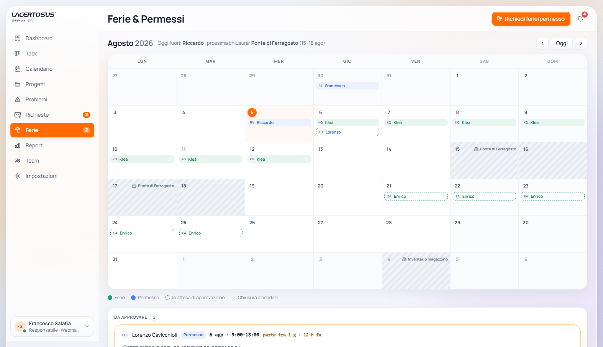
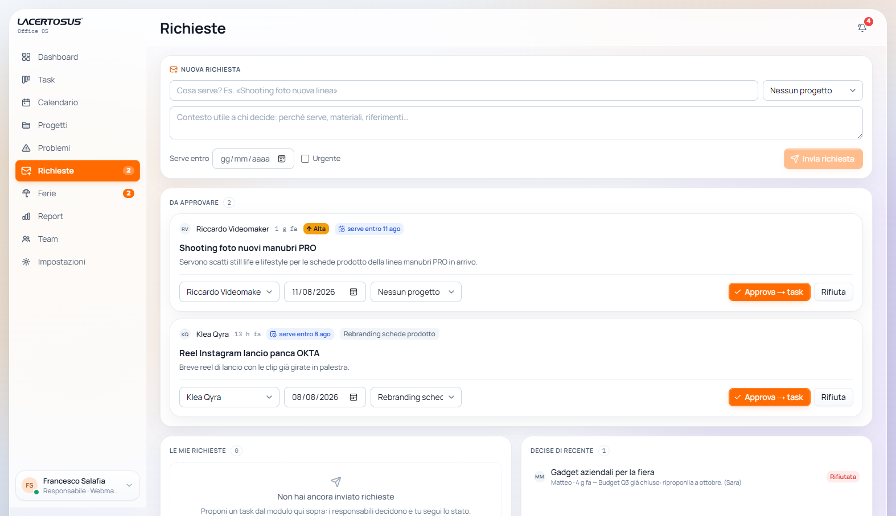
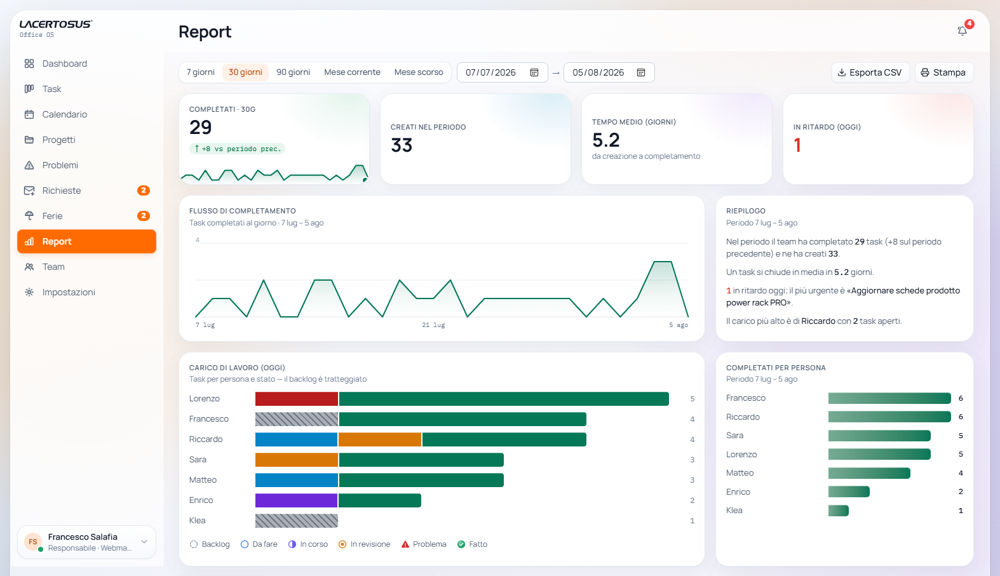
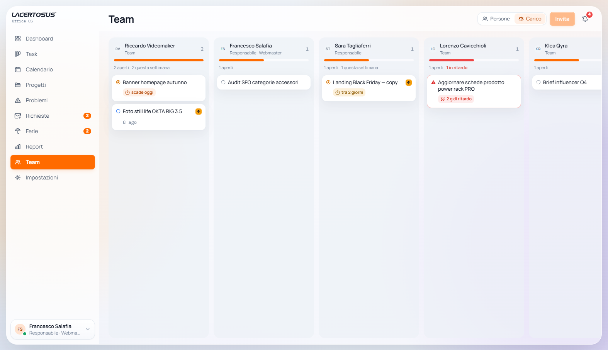

<div align="center">


# Office OS

**La piattaforma operativa dell'ufficio marketing ed e-commerce Lacertosus.**
Task, progetti, richieste, ferie e report in un'unica app: semplice, veloce, senza fronzoli.


-6D5DFB)




</div>

---

## Indice

- [Panoramica](#panoramica)
- [Funzionalità](#funzionalità)
- [Architettura](#architettura)
- [Performance](#performance)
- [Avvio rapido](#avvio-rapido)
- [Verifica end-to-end](#verifica-end-to-end)
- [Struttura del repo](#struttura-del-repo)
- [Documentazione](#documentazione)
- [Come lavoriamo](#come-lavoriamo)

## Panoramica

Office OS è il gestionale interno dell'ufficio: un **hub di task condiviso** dove il team pianifica il lavoro (board Kanban, calendario, progetti), propone e approva nuove attività (richieste), gestisce assenze (ferie e permessi con chiusure aziendali) e misura l'andamento (report su dati reali). Interfaccia interamente in italiano, desktop-first e completamente responsive.

Principi di prodotto (da [`docs/CLAUDE.md`](docs/CLAUDE.md)):

- **Semplicità prima della quantità di funzioni** — nessuna pagina richiede formazione.
- **Ogni task ha un solo responsabile** e al massimo una manciata di stati.
- **Progressive disclosure**: la creazione rapida chiede solo il titolo, il resto vive nel pannello.
- **Pannelli laterali, non modali**: ogni task è linkabile e condivisibile via URL.
- L'arancio Lacertosus è riservato ad azioni primarie ed evidenze.

**Stato del progetto**: frontend completo e verificato, con **strato dati placeholder** (localStorage versionato) che replica il contratto delle future query Supabase — schema SQL, RLS e piano di migrazione sono già scritti (`supabase/migrations/`, [`docs/DATABASE_SCHEMA.md`](docs/DATABASE_SCHEMA.md), [`docs/SECURITY_MODEL.md`](docs/SECURITY_MODEL.md)). Al collegamento del backend cambia lo strato dati, non l'interfaccia.

## Funzionalità

### 📊 Dashboard personale

Pagina di atterraggio con saluto contestuale, **anello di efficienza settimanale**, KPI color-coded con trend (sparkline sui completamenti reali), **Focus di oggi** (fino a 3 task scelti con la stella), avvisi recenti, i propri task aperti, ritardi, scadenze della settimana e **polso del team** (carico per persona con barre per stato).

La dashboard è **componibile**: i blocchi si riordinano col drag (animazione FLIP), si ridimensionano, si nascondono e si ripristinano con un click.

### 🗂️ Board dei task



Board a corsie con i 6 stati del flusso — Backlog, Da fare, In corso, In revisione, **Problema**, Fatto — più fino a **3 fasi custom** (solo admin, colori pre-approvati). Tutto pensato per la velocità d'uso:

- **Drag & drop artigianale** (zero dipendenze) con auto-scroll ai bordi, ghost che segue il puntatore fuori da React e annullamento con Esc.
- **Tastiera completa**: frecce per selezionare, Invio apre, `Shift+←/→` sposta di fase, `/` va al filtro.
- **Annulla (undo)** su spostamenti e completamenti, direttamente dal toast.
- Fasi **comprimibili** in strip verticali (persistite per utente), filtri per responsabile e progetto nell'URL, **viste salvate** riapplicabili con un click.
- Vista **Elenco** (righe dense raggruppate per stato) e **Archivio** ricercabile: i «Fatto» escono dalla board dopo 14 giorni ma restano in archivio e nei report, con ripristino.

### 📝 Pannello del task



Dettaglio in **vista grande** centrata o pannello laterale compatto (preferenza ricordata), sempre indirizzabile via URL (`?task=<id>`):

- Stato, priorità, responsabile, scadenza con **chip di urgenza**, progetto e **ripetizione furba** (settimanale, ogni 2 settimane, mensile: al completamento il task si ricrea con la scadenza avanzata e la checklist azzerata).
- **Checklist interattiva** con barra di avanzamento, visibile anche sulle card («2/4»).
- **Allegati-link** con anteprima delle immagini (in attesa di Supabase Storage).
- **Commenti e attività**: menzioni `@Nome` e `@Team` che generano avvisi reali, reazioni rapide, marcatura **«Decisione»**, citazione, e la **cronologia eventi** append-only (creazioni, cambi stato/scadenza/responsabile/priorità) fusa nella timeline.
- **Snooze personale** (domani / +3 giorni): il task sparisce dalle proprie viste e torna con un avviso.
- **Segnala problema** con motivo: il task entra in fase Problema, admin e responsabile vengono avvisati; pagina dedicata con tempo-in-fase ed **escalation automatica** oltre le 48h.
- **Sollecita** il responsabile con un click; navigazione `‹ ›` tra i task nell'ordine della board.
- **Pacchetti**: template multi-task con scadenze relative a una data àncora (es. «Lancio prodotto» = 5 task collegati), con i fratelli visibili nel dettaglio.

### 📆 Calendario delle scadenze



Mese con i task sul giorno di scadenza: **drag del chip** per rispostare la data, «+» sul giorno per creare al volo con scadenza precompilata.

### 🌴 Ferie & Permessi



Richieste di ferie e permessi con **conteggio automatico dei giorni lavorativi** (weekend e chiusure esclusi), approvazione o rifiuto motivato dei responsabili, e **calendario dell'ufficio** con le assenze approvate e le **chiusure aziendali** (fondo a righe, leggibile anche senza colore). Promemoria automatico ai responsabili quando una richiesta langue o la partenza è vicina.

### 📥 Richieste di task



Chiunque propone un'attività (titolo, contesto, «serve entro», urgenza); i responsabili la **approvano scegliendo assegnatario, scadenza e progetto** — nasce il task collegato, con provenienza visibile nel dettaglio — oppure la rifiutano con un motivo. Ritiro delle proprie richieste in attesa, promemoria anti-attesa dopo 3 giorni.

### 📈 Report



Analisi su **dati reali** (i completamenti nascono da `completed_at`, archiviati inclusi): KPI del periodo con delta sul periodo precedente, **trend giornaliero**, carico per persona per stato, distribuzione per progetto, completati per persona e tempo medio di attraversamento. Intervalli preset (7/30/90 giorni, mese corrente/scorso) o personalizzati, **export CSV** e **stampa** con stili dedicati. Grafici SVG fatti in casa, palette validata per il daltonismo.

### 👥 Team e carico



Elenco persone con ruolo e qualifica, e vista **Carico**: una colonna per persona con i task aperti in ordine di scadenza e barra di carico relativa — si vede chi è saturo *prima* di assegnare.

### 🔔 Notifiche

Campanella con tab **Tutte / Menzioni / Solleciti**, raggruppamento degli avvisi per task con segna-letto di gruppo, contatore non letti. Le escalation automatiche (problemi fermi, richieste e ferie in attesa) sono **one-shot per episodio**: marcatori persistiti, zero doppioni tra un ricaricamento e l'altro.

### ⌨️ Produttività

- **Command palette** (`⌘K` / `Ctrl+K`): azioni rapide, navigazione, ricerca di task, progetti e persone.
- **Modalità standup**: vista da proiettare nel daily.
- **Pianificatore «Ricorrenti»** (solo admin): le attività standard del mese, già attive o da lanciare con data e responsabile regolabili; template configurabili da Impostazioni.
- **Tour introduttivo** per i nuovi utenti (riapribile con `?tour=1`), **backup/import JSON** della configurazione.

### 🎨 Personalizzazione

Impostazioni → Aspetto: **6 accenti colore**, **3 densità** (l'intera UI si riscala), **movimento ridotto** manuale (oltre al rispetto automatico di `prefers-reduced-motion`). Foto profilo con **upload e ritaglio quadrato** lato client.

### 🦎 Il Capo

Easter egg motivazionale: *Claudio P., il Cavaliere di Parma* appare a sorpresa e commenta i **dati veri** dello store (ritardi, revisioni, completamenti). Congedabile con un click, silenziabile per la giornata («Non oggi, capo»).

## Architettura

| Livello | Scelta |
|---|---|
| Framework | **Next.js 16.3** (App Router, Turbopack) con **React Compiler nativo Rust** |
| UI | **React 19**, Tailwind CSS 4, shadcn/ui + Radix, Motion 12, grafici SVG in casa |
| Linguaggio | TypeScript **strict** |
| Dati (oggi) | Store client placeholder (`lib/store.tsx`) + **localStorage versionato** |
| Dati (domani) | **Supabase** (PostgreSQL + RLS): migrazione iniziale già scritta, store a parità di firma |
| Qualità | ESLint 9, `tsc --noEmit`, suite di verifica end-to-end via Edge CDP |

Le scelte che rendono l'app veloce (dettagli in [`docs/architecture.md`](docs/architecture.md)):

- **Tutte le route sono statiche** e quindi prefetchate per intero: i cambi pagina sono istantanei. Lo stato di vista (`?task=`, `?view=`, filtri) vive nell'URL ma viaggia **shallow** con la History API nativa (`lib/shallow-nav.ts`, `SearchLink`) — zero round-trip al server sui click.
- **React Compiler** memoizza automaticamente componenti e derivazioni; il context dello store è ricreato solo quando cambia davvero lo stato.
- **Mutazioni istantanee** con firme async: gli stati di caricamento restano nel contratto per Supabase, senza latenze artificiali.
- **Code-splitting mirato**: gli overlay ambientali (palette, Capo, tour), le viste secondarie e la modalità standup viaggiano in chunk lazy pre-caricati all'hover; il pannello task resta nel bundle perché sta sul percorso di ogni click.
- **Drag senza re-render**: il ghost della board segue il puntatore via motion value fuori da React.
- Persistenza **nei momenti di quiete** del browser (`requestIdleCallback`), mai dentro un frame di interazione.

## Performance

Misure su build di produzione, browser reale (Edge CDP):

| Interazione | Tempo |
|---|---|
| Invio di una richiesta (submit) | **13–22 ms** |
| Apertura del pannello task | **31–84 ms**, nessuna navigazione |
| Cambio vista / filtri / chiusura pannello | **~1 ms** (shallow) |
| Cambio pagina | route statiche prefetchate → istantaneo |

## Avvio rapido

Requisiti: **Node.js ≥ 20.9** (consigliato 24 LTS), npm.

```bash
npm ci            # installa esattamente il lockfile
npm run dev       # sviluppo su http://localhost:3000
```

```bash
npm run build     # build di produzione (Turbopack)
npm start         # serve la build
npm run typecheck # TypeScript senza emit
npm run lint      # ESLint
```

I dati demo (≈60 giorni di storico deterministico) si caricano da soli al primo avvio e persistono in localStorage; «Azzera dati demo» in Impostazioni → Workspace riparte dai seed.

## Verifica end-to-end

In `scripts/` vive una suite di verifica **senza framework**: script Node che pilotano **Edge headless via Chrome DevTools Protocol** (porta 9223) contro la build di produzione e stampano PASS/FAIL con evidenze e screenshot.

```bash
# in un terminale: l'app in produzione
npm run build && npm start

# in un altro: Edge headless con CDP
msedge --headless=new --remote-debugging-port=9223 --user-data-dir=%TEMP%\edge-verify

# poi, ad esempio:
node scripts/deep-verify.mjs        # percorso completo: board, undo, pannello, planner, archivio, notifiche, report…
node scripts/board-drag-verify.mjs  # drag con auto-scroll ai bordi (finestra 900px)
node scripts/leave-verify.mjs       # flusso ferie e chiusure
node scripts/mobile-probe.mjs       # sonde responsive
```

## Struttura del repo

```
app/
  (app)/            # area autenticata: dashboard, tasks, calendar, projects,
                    # problems, requests, leave, reports, team, settings
  login/            # accesso (placeholder)
components/
  board/            # board Kanban: corsie, card, filtri
  charts/           # grafici SVG: trend, barre, sparkline, stat tile
  shell/            # sidebar, topbar, overlay globali (lazy)
  ui/               # primitive: button, input, segmented, select…
  *.tsx             # feature: task-panel, calendar-view, leave-content, report…
lib/
  store.tsx         # store placeholder: contratto per Supabase + persistenza
  shallow-nav.ts    # navigazione shallow (History API integrata nel router)
  leave.ts          # logica pura ferie/chiusure (giorni lavorativi…)
  analytics.ts      # motore dei report
  mock-data.ts      # seed demo deterministici
docs/               # requisiti, architettura, schema DB, sicurezza, design system
scripts/            # verifiche end-to-end via CDP + gestione worktree
supabase/           # migrazione SQL iniziale (schema + RLS + trigger)
```

## Documentazione

| Documento | Contenuto |
|---|---|
| [`docs/CLAUDE.md`](docs/CLAUDE.md) | Requisiti e principi di prodotto |
| [`docs/architecture.md`](docs/architecture.md) | Piano di architettura ed emendamenti approvati |
| [`docs/DATABASE_SCHEMA.md`](docs/DATABASE_SCHEMA.md) | Schema PostgreSQL/Supabase formale |
| [`docs/SECURITY_MODEL.md`](docs/SECURITY_MODEL.md) | Modello di sicurezza: ruoli, RLS, service role |
| [`docs/design-system.md`](docs/design-system.md) | Token, tipografia, colore, motion |
| [`docs/ui-primitives.md`](docs/ui-primitives.md) | Catalogo dei componenti riusabili |
| [`CHANGELOG.md`](CHANGELOG.md) | Storico di tutti gli update (uno per Release GitHub) |

## Come lavoriamo

Flusso a **branch personali + Pull Request** (mai commit diretti su `master`), con un comando dedicato per le **sessioni parallele** in copie isolate del repo:

```bash
node scripts/worktree.mjs nuovo francesco-argomento-feature   # copia + branch da origin/master
node scripts/worktree.mjs elenco
node scripts/worktree.mjs chiudi francesco-argomento-feature  # dopo il merge della PR
```

Ogni upgrade o nuova funzionalità arriva su GitHub anche come **Update**: voce
nel [`CHANGELOG.md`](CHANGELOG.md) nella stessa PR e Release «Update» dopo il
merge. Regole complete in [`CONTRIBUTING.md`](CONTRIBUTING.md).

---

<div align="center">

Fatto su misura per l'ufficio Lacertosus 🦎 · UI in italiano · agosto 2026

</div>
